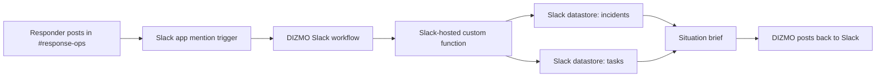

# DIZMO

**The Disaster Relief Command Agent for Slack**

DIZMO is now a Slack-hosted command agent. The judge-facing product surface is the Slack sandbox workspace, specifically the `#response-ops` channel, not a Cloud Run web URL.

## What Changed

We removed the Cloud Run-first submission path and rebuilt the deployable agent around Slack's Deno SDK and Run On Slack Infrastructure.

The Slack-hosted implementation lives here:

```text
apps/slack-hosted
```

It includes:

- Slack app manifest
- Slack-hosted incident datastore
- Slack-hosted task datastore
- App mention workflow
- Situation brief workflow
- Report intake workflow
- DIZMO app icon
- Slack trigger definitions for `#response-ops`

## Judge Experience

Judges should be added to the Slack Developer Sandbox as members.

They test DIZMO inside Slack:

```text
@DIZMO Shelter North has only 12 water crates left. 80 people inside and two buses arriving.
```

Then:

```text
@DIZMO summarize current situation
```

DIZMO stores incidents in Slack-hosted datastore storage and posts operational responses back into the Slack channel.

## Slack-Only Architecture



## Required Slack Technologies

DIZMO uses Slack platform capabilities directly:

- Slack Deno SDK
- Slack Run On Slack Infrastructure
- Slack workflows
- Slack event triggers
- Slack custom functions
- Slack datastores
- Slack sandbox workspace

This keeps the submission aligned with the hackathon sandbox workflow and avoids asking judges to open a backend URL.

## Local Files

```text
apps/slack-hosted/manifest.ts
apps/slack-hosted/datastores/incidents.ts
apps/slack-hosted/datastores/tasks.ts
apps/slack-hosted/functions/intake_report.ts
apps/slack-hosted/functions/build_brief.ts
apps/slack-hosted/functions/create_task.ts
apps/slack-hosted/workflows/mention_workflow.ts
apps/slack-hosted/workflows/brief_workflow.ts
apps/slack-hosted/triggers/mention_response_ops.ts
```

## Deploy To Slack

Install/login once:

```powershell
slack login
```

Deploy:

```powershell
cd "E:\slzack agent\apps\slack-hosted"
slack deploy
slack trigger create --trigger-def triggers\mention_response_ops.ts
slack trigger create --trigger-def triggers\brief_shortcut.ts
```

## Verification

The Slack-hosted TypeScript currently passes:

```powershell
deno check manifest.ts triggers/*.ts functions/*.ts workflows/*.ts datastores/*.ts lib/*.ts
```

Cloud Run is no longer the submission path.
