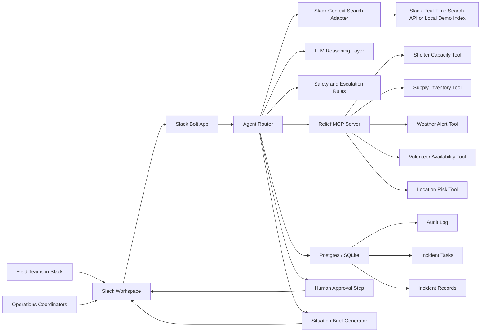
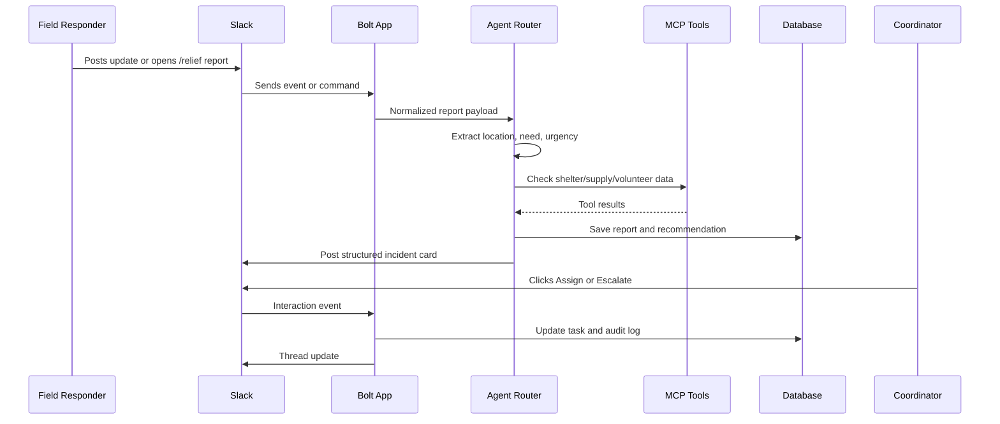
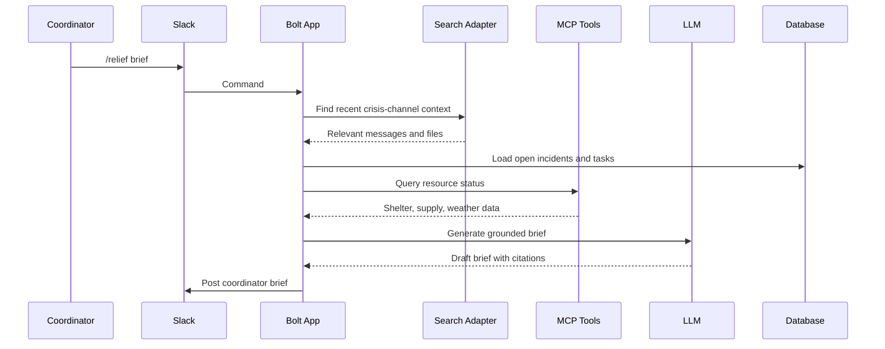
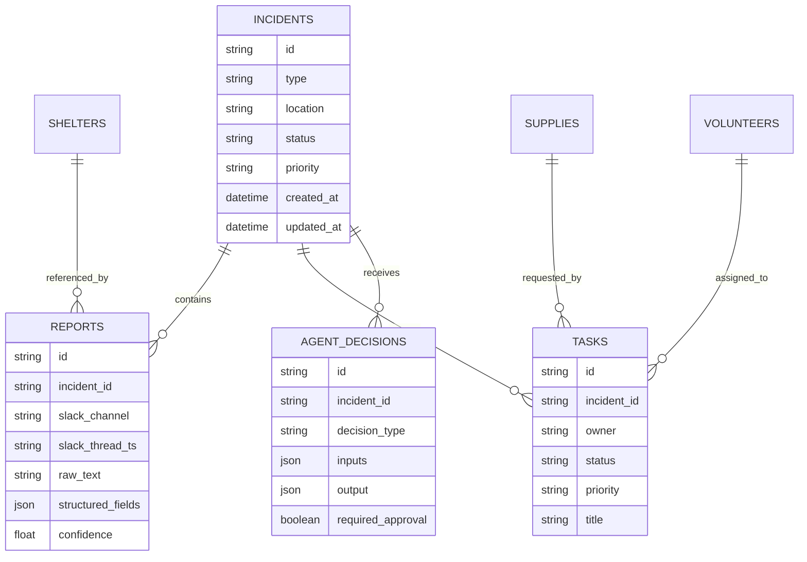
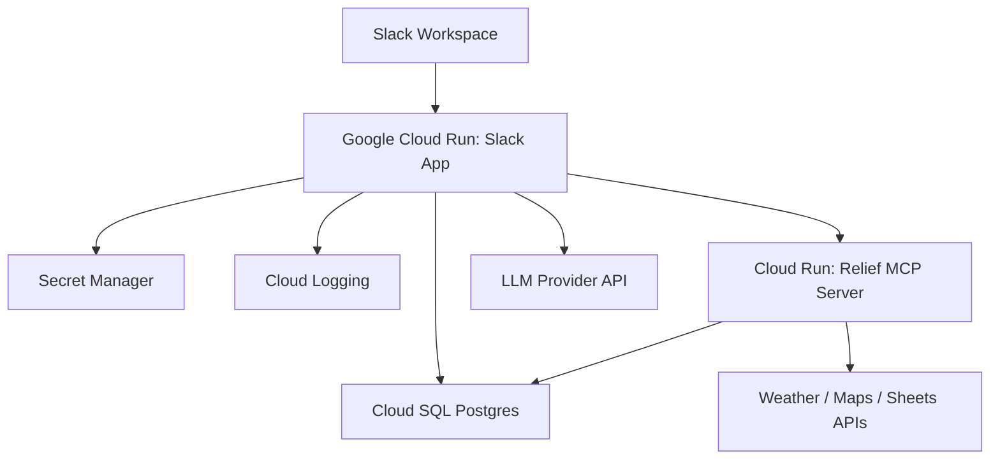

# System Architecture: DIZMO

## One-Sentence Summary

**DIZMO**, the Disaster Intelligence Zone Management Operator, is a Slack-native coordination system that monitors crisis channels, structures field reports, searches recent operational context, consults external response tools through MCP, and recommends prioritized actions for human approval.

## Architecture Goals

- Make Slack the command center for disaster response.
- Convert messy messages into structured, actionable incident intelligence.
- Keep humans in control of high-impact decisions.
- Use agentic reasoning only where it improves speed and clarity.
- Make the demo reliable under hackathon conditions.

## High-Level Diagram

## Core Components

### 1. Slack Interface

The Slack app is the main product surface.

Inputs:

- Channel messages in response channels.
- App mentions.
- Slash commands.
- Structured report modals.
- Button clicks from coordinators.

Outputs:

- Incident summaries.
- Risk alerts.
- Assignment suggestions.
- Situation briefs.
- Threaded updates.
- Action buttons for human approval.

Primary commands:

- `/relief report` opens a field report modal.
- `/relief status` returns current incident status.
- `/relief brief` generates a situation brief.
- `/relief simulate` injects demo events.

### 2. Slack Bolt App

The Bolt app receives Slack events and routes them into the agent workflow.

Responsibilities:

- Verify Slack requests.
- Parse commands and interactions.
- Normalize Slack events.
- Send responses back to Slack.
- Preserve thread context.
- Trigger agent workflows.

### 3. Agent Router

The router decides what should happen for each incoming event.

Example routing:

- A short field update becomes a candidate report.
- A supply shortage triggers inventory lookup.
- A shelter capacity warning triggers capacity and volunteer checks.
- A coordinator command triggers a full situation brief.

The router should be deterministic around sensitive actions. The model can recommend, but the system decides when human approval is required.

### 4. Slack Context Search Adapter

This adapter retrieves recent and relevant Slack context.

Uses:

- Find reports about the same location.
- Detect duplicate incidents.
- Gather updates from the last 30 minutes.
- Pull supporting evidence for an alert.

Production path:

- Slack Real-Time Search API.

Hackathon fallback:

- Local indexed demo messages seeded from fixtures.

The public interface should stay the same so the demo and production path share the same architecture.

### 5. Relief MCP Server

The MCP server exposes response tools to the agent.

Tools:

- `get_shelter_capacity(location)`
- `get_supply_status(item, location)`
- `find_available_volunteers(skill, location)`
- `get_weather_alerts(location)`
- `estimate_location_risk(location, incident_type)`
- `create_response_task(title, owner, priority, incident_id)`

Why MCP matters:

- Shows the agent can use external systems through a standard tool layer.
- Makes the architecture extensible.
- Separates operational systems from Slack interaction logic.

### 6. LLM Reasoning Layer

The model is used for tasks that benefit from language understanding.

Model tasks:

- Classify incoming reports.
- Extract structured fields from free text.
- Summarize long threads.
- Generate situation briefs.
- Compare conflicting updates.
- Draft suggested next actions.

The model should not directly:

- Assign emergency priority without rule validation.
- Mark an incident resolved.
- Send external notifications without approval.
- Invent shelter or supply data.

### 7. Safety and Escalation Rules

Rules protect the workflow from overconfident automation.

Examples:

- Any report containing `injury`, `trapped`, `missing`, or `medical` becomes high priority.
- Any action that changes task ownership requires a coordinator click.
- Any low-confidence extraction is posted as a clarification request.
- Any conflicting shelter capacity update is flagged for review.

### 8. Database

The database stores operational state and audit history.

Key tables:

- `incidents`: canonical incident records.
- `reports`: raw and structured field reports.
- `shelters`: capacity and status.
- `supplies`: inventory by location.
- `volunteers`: availability and skills.
- `tasks`: response tasks and assignments.
- `agent_decisions`: recommendations and model outputs.
- `audit_log`: every important system action.

### 9. Situation Brief Generator

Generates a coordinator-ready update.

Brief format:

- Current situation.
- Highest-risk locations.
- Unresolved blockers.
- Resource shortages.
- Recommended next actions.
- New changes since previous brief.

## Main Workflows

### Workflow A: Field Report Intake

### Workflow B: Situation Brief

### Workflow C: Shortage Escalation

1. A shelter lead reports: "Shelter North is down to 12 water crates, 80 people inside, more buses arriving."
2. Agent extracts:
   - Location: Shelter North
   - Resource: water
   - Capacity pressure: high
   - Urgency: high
3. MCP checks inventory and nearby shelters.
4. Agent finds Slack context showing two prior water complaints.
5. Agent posts an escalation card with:
   - Evidence
   - Suggested owner
   - Suggested action
   - Approval buttons
6. Coordinator approves.
7. Task is created and logged.

## Data Model

## Demo Scenario

Scenario: Flood response in a mid-sized city.

Channels:

- `#flood-response`
- `#shelter-ops`
- `#supply-desk`
- `#volunteer-dispatch`

Demo sequence:

1. Use `/relief simulate` to inject a flood event.
2. Field responder submits a trapped-family report.
3. Shelter lead reports water shortage.
4. Agent searches Slack context and identifies duplicate reports.
5. Agent checks shelter capacity and supply inventory through MCP.
6. Agent posts prioritized action cards.
7. Coordinator approves an assignment.
8. Coordinator runs `/relief brief`.
9. Agent posts a concise situation brief.

## Trust and Safety

Principles:

- The agent recommends; humans approve.
- Every recommendation includes evidence.
- Every action is logged.
- The system avoids pretending to know unavailable facts.
- The demo uses fictional data.

High-risk actions requiring approval:

- Assigning volunteers.
- Marking incidents resolved.
- Sending public alerts.
- Escalating medical or rescue events.
- Changing shelter status.

## Deployment Architecture

## MVP Scope

Must have:

- Slack app with `/relief report`, `/relief brief`, `/relief simulate`.
- Incident extraction from free text.
- MCP-style tools for shelters and supplies.
- Search adapter with local demo index or Slack RTS if available.
- Human approval buttons.
- Audit log.
- Architecture diagram.
- Three-minute demo script.

Should have:

- Weather API adapter.
- Volunteer matching.
- Duplicate report detection.
- Confidence scores.

Could have:

- SMS escalation.
- Map dashboard.
- Multilingual intake.
- Real-time analytics dashboard.

## Technical Risks

### Slack RTS Access

Risk: Real-Time Search API access may be gated.

Mitigation: Build a search adapter with a local demo index and clearly document the production RTS path.

### MCP Complexity

Risk: MCP implementation can consume time.

Mitigation: Build a small custom MCP server exposing 4-6 tools. Keep tool responses deterministic.

### LLM Reliability

Risk: Model output may be inconsistent.

Mitigation: Use schemas, confidence thresholds, validation, and fallback templates.

### Demo Fragility

Risk: External APIs may fail during recording.

Mitigation: Seed demo fixtures and make simulation deterministic.
